# Epic/Story 拆分 · 诸子百家·口诛笔伐 · Demo

**版本**: v1.1
**日期**: 2026-07-09
**作者**: 程基岩（engineering-lead）
**输入**: 控制清单.md（72项）、系统依赖排序图.md（25系统+4批次）、主架构文档.md、ADR-001~004、GDD v0.2 增补
**用途**: 把架构翻译成可执行的 Story，一人+AI工具链按此文档逐条实现
**修订记录**: v1.1 (2026-07-09) — 根据4项主理人决策（D1/D6/D7/D8）更新 S02/S30/S31/S32/S33/S34/S38/S42/S49/S51 验收标准

---

## 0. 阅读指南

### 目录结构映射

主架构文档定义的是 `Assets/_Project/Scripts/` 下按架构分层（Foundation/Config/Input/Gameplay/UI/Game），但 D 盘已建好的工程目录使用按模块分层。两者映射如下：

| 架构文档目录 | D盘实际目录 | 说明 |
|-------------|-----------|------|
| Foundation/ | `Assets/Scripts/Core/` | ObjectPool/EventBus/ServiceLocator/SaveSystem |
| Config/ | `Assets/Scripts/Core/` (ConfigLoader) + `Assets/Configs/` (JSON) | 配置加载放 Core，JSON 放 Configs |
| Input/ | `Assets/Scripts/Core/` | 输入层放 Core |
| Gameplay/GameState/ | `Assets/Scripts/Flow/` | 状态机属流程控制 |
| Gameplay/Player/ | `Assets/Scripts/Core/` | PlayerSystem 是核心实体 |
| Gameplay/Combat/ | `Assets/Scripts/Combat/` | 战斗系统 |
| Gameplay/Weapon/ | `Assets/Scripts/Combat/` | 武器属战斗 |
| Gameplay/Bullet/ | `Assets/Scripts/Combat/` | 弹幕属战斗 |
| Gameplay/Enemy/ | `Assets/Scripts/Enemy/` | 敌人系统 |
| Gameplay/Boss/ | `Assets/Scripts/Enemy/` | Boss 属敌人模块 |
| Gameplay/Wave/ | `Assets/Scripts/Flow/` | 波次属流程 |
| Gameplay/Economy/ | `Assets/Scripts/Economy/` | 经济系统 |
| Gameplay/Item/ | `Assets/Scripts/Economy/` | 器物属经济 |
| Gameplay/Difficulty/ | `Assets/Scripts/Flow/` | 难度属流程 |
| UI/ | `Assets/Scripts/UI/` | UI 层 |
| Game/ | `Assets/Scripts/Core/` | GameManager/Bootstrapper |
| Render (灰模) | `Assets/Scripts/Render/` | 灰模视觉/听觉 |

**约定**：下文 Story 的"涉及文件路径"均使用 D 盘实际目录。

### 工时预估说明

一人 + AI 工具链节奏。AI 辅助能将纯编码效率提升 2-3 倍，但调试/手感调参/集成验证仍需人工。预估工时 = AI辅助编码(1h) + 调试验证(1-2h)。

### 并行/串行标记

- **可并行**：该 Story 与前置依赖无冲突，可与其他 Story 同时进行
- **必须串行**：该 Story 依赖前置 Story 的产出物（接口/配置/测试），必须等前置完成

---

## 1. Story 依赖关系图

```mermaid
graph TD
    %% ===== Epic-0: 引擎骨架 =====
    S01[S01: Unity工程初始化<br/>+URP+目录+场景]
    S02[S02: Project Settings<br/>+Input System版本确定]
    S03[S03: Foundation层<br/>ObjectPool/EventBus/ServiceLocator]
    S04[S04: SaveSystem<br/>+Foundation测试]

    %% ===== Epic-0 Config 骨架 =====
    S05[S05: ConfigLoader<br/>+ConfigValidator]
    S06[S06: C#强类型绑定类<br/>9个配置定义]
    S07[S07: input_mapping.json<br/>+schools.json]

    %% ===== Epic-1: P0 核心 =====
    S08[S08: Input层<br/>GameInputAction+InputReader+Dispatcher]
    S09[S09: GameStateMachine<br/>+9状态类骨架]
    S10[S10: 灰模Shader+SpriteGenerator<br/>+命中闪烁+死亡碎裂]
    S11[S11: 玩家灰模Prefab<br/>+弟子灰模Prefab]
    S12[S12: 弹幕灰模Prefab<br/>7种形状]
    S13[S13: bullets.json<br/>8种弹幕完整配置]
    S14[S14: PlayerSystem<br/>移动/HP/体力]
    S15[S15: CombatSystem<br/>伤害公式5层]
    S16[S16: BulletSystem<br/>+BulletEntity行为分发]
    S17[S17: 射艺主武器<br/>普通射击+蓄力穿透箭]
    S18[S18: 闪避/冲刺系统<br/>Shift分流逻辑]
    S19[S19: 灰模听觉<br/>4类占位音效]
    S20[S20: enemies.json<br/>6弟子配置]
    S21[S21: EnemySystem<br/>弟子AI+碰撞检测]
    S22[S22: weapons.json<br/>3武器×5级配置]
    S23[S23: waves.json<br/>5波+3Boss波配置]
    S24[S24: EconomySystem<br/>学识掉落/拾取]
    S25[S25: HUD UI<br/>HP条/体力条/学识计数]
    S26[S26: 教学波集成<br/>波次子集+首次跑通]

    %% ===== Epic-2: P1 完整体验 =====
    S27[S27: 御艺主武器<br/>冲刺伤害带]
    S28[S28: 礼艺主武器<br/>推力波+屏障反弹+礼刺]
    S29[S29: 学派被动系统<br/>儒回血/法攻+10%/道无冷却]
    S30[S30: bosses.json<br/>3宗师×3阶段配置]
    S31[S31: BossSystem框架<br/>阶段切换+弹幕轮转]
    S32[S32: 儒宗师Boss<br/>3阶段逼近压迫型]
    S33[S33: 法宗师Boss<br/>3阶段锁定追踪型]
    S34[S34: 道宗师Boss<br/>3阶段波纹+瞬移+浅水]
    S35[S35: Boss灰模Prefab<br/>3宗师六边形]
    S36[S36: 学识升级系统<br/>波次间升级+分支选择]
    S37[S37: 副技能系统<br/>副艺选择+等级继承]
    S38[S38: 完整波次系统<br/>5波+3Boss波推进]
    S39[S39: CharacterSelect UI<br/>学派+主武器+副技能选择]
    S40[S40: UpgradePanel UI<br/>波次间升级面板]
    S41[S41: MainMenu UI<br/>+VictoryScreen UI]
    S42[S42: Bootstrapper集成<br/>全流程串联]

    %% ===== Epic-3: P2 增强 =====
    S43[S43: items.json<br/>定身符+仁义之心配置]
    S44[S44: ItemSystem<br/>器物效果应用]
    S45[S45: Shop UI<br/>器物店界面]
    S46[S46: difficulty.json<br/>低/中/高3档配置]
    S47[S47: DifficultySystem<br/>难度参数覆盖]
    S48[S48: DeathScreen UI<br/>死亡数据面板]
    S49[S49: 灰阶可辨测试<br/>CONCERN-2验证]
    S50[S50: 性能预算验证<br/>60fps+200弹幕+零GC]
    S51[S51: 完整流程冒烟测试<br/>MainMenu→Victory/Death]

    %% ===== 依赖线 =====
    S01 --> S02
    S01 --> S03
    S03 --> S04
    S01 --> S05
    S05 --> S06
    S06 --> S07
    S03 --> S08
    S07 --> S08
    S05 --> S09
    S03 --> S09
    S01 --> S10
    S10 --> S11
    S10 --> S12
    S06 --> S13
    S13 --> S16
    S03 --> S14
    S07 --> S14
    S14 --> S15
    S05 --> S15
    S16 --> S17
    S13 --> S17
    S14 --> S18
    S08 --> S18
    S10 --> S19
    S06 --> S20
    S11 --> S21
    S20 --> S21
    S14 --> S21
    S06 --> S22
    S06 --> S23
    S21 --> S24
    S14 --> S25
    S24 --> S26
    S21 --> S26
    S17 --> S26
    S18 --> S26

    S17 --> S27
    S18 --> S27
    S14 --> S29
    S18 --> S29
    S06 --> S30
    S21 --> S31
    S16 --> S31
    S31 --> S32
    S29 --> S32
    S31 --> S33
    S29 --> S33
    S31 --> S34
    S29 --> S34
    S10 --> S35
    S24 --> S36
    S22 --> S36
    S36 --> S37
    S17 --> S37
    S27 --> S37
    S28 --> S37
    S26 --> S38
    S36 --> S38
    S32 --> S38
    S09 --> S39
    S38 --> S42
    S39 --> S42
    S40 --> S42
    S41 --> S42

    S38 --> S43
    S31 --> S44
    S43 --> S44
    S44 --> S45
    S38 --> S46
    S31 --> S47
    S46 --> S47
    S24 --> S48
    S12 --> S49
    S16 --> S49
    S42 --> S50
    S42 --> S51

    %% ===== 关键路径高亮 =====
    classDef critical fill:#e74c3c,stroke:#c0392b,color:#fff,stroke-width:3px
    classDef normal fill:#3498db,stroke:#2874a6,color:#fff
    classDef p2 fill:#27ae60,stroke:#1e8449,color:#fff

    class S01,S03,S05,S06,S07,S08,S14,S15,S16,S17,S18,S21,S24,S26 critical
    class S02,S04,S09,S10,S11,S12,S13,S19,S20,S22,S23,S25 normal
    class S27,S28,S29,S30,S31,S32,S33,S34,S35,S36,S37,S38,S39,S40,S41,S42 normal
    class S43,S44,S45,S46,S47,S48,S49,S50,S51 p2
```



### 关键路径（Critical Path）

从第一个 Story 到最小可验证单元（教学波跑通）的最短路径：

```
S01 → S03 → S05 → S06 → S07 → S08 → S14 → S15
                                              ↓
S01 → S10 → S11 → S21 → S24 → S26（教学波集成）
                ↑
S06 → S13 → S16 → S17 → S26
        ↑
S14 → S18 → S26
```

**关键路径 Story 数**: 14 个（S01, S03, S05, S06, S07, S08, S10, S11, S13, S14, S15, S16, S17, S18, S21, S24, S26）

**最小可验证单元完成标志**: S26（教学波集成）跑通 = 玩家能 WASD 移动、左键射箭、Shift 闪避、打教学波敌人、掉落学识、受伤死亡——核心 moment-to-moment loop 可跑。

---

## 2. Epic-0: 引擎骨架（对应批次0）

> **目标**: Unity 工程能跑起来，Foundation/Config/Input 骨架就位，第一个 Story 就是"能运行的空场景"。
> **对应控制清单**: B1-B8, C1-C5, D1-D2, D10, D12, E1, F1
> **预估总工时**: 18-22 小时

---

### S01: Unity 工程初始化 + URP 配置 + 目录结构 + 场景创建

| 属性 | 值 |
|------|-----|
| Story ID | ENG-001-S01 |
| 标题 | Unity 工程初始化 + URP 配置 + 目录结构 + 三场景创建 |
| 所属 Epic | Epic-0 |
| 优先级 | P0 |
| 依赖 | 无（第一个 Story） |
| 预估工时 | 3h |
| 对应控制清单 | B1, B2, B3, B4, B5, B6 |

**验收标准**:
- [ ] Unity 2022.3.62f3c1 工程已创建，PC Standalone 平台
- [ ] URP 模板已安装，2D 渲染配置完成
- [ ] `Assets/Scripts/` 下 7 个子目录已创建（Core/Combat/Enemy/Economy/Flow/Render/UI）
- [ ] `Assets/Configs/` 目录已创建
- [ ] `Assets/Prefabs/` 目录及子目录已创建（Player/Enemies/Bosses/Bullets/Effects/UI）
- [ ] `Assets/Art/` 目录及子目录已创建（Sprites/Shaders/Materials）
- [ ] `Assets/Audio/` 目录已创建
- [ ] `Assets/Scenes/` 下 3 个场景已创建：Boot.unity, MainMenu.unity, Game.unity
- [ ] Boot 场景能在 Editor 中运行（空场景，不报错）

**涉及文件路径**:
- `D:/诸子百家_口诛笔伐/UnityProject/`（工程根目录）
- `D:/诸子百家_口诛笔伐/Assets/Scenes/Boot.unity`
- `D:/诸子百家_口诛笔伐/Assets/Scenes/MainMenu.unity`
- `D:/诸子百家_口诛笔伐/Assets/Scenes/Game.unity`

**并行/串行**: 必须串行（所有后续 Story 的前置）

---

### S02: Project Settings 配置 + Input System 版本确定

| 属性 | 值 |
|------|-----|
| Story ID | ENG-001-S02 |
| 标题 | Project Settings（帧率/分辨率/质量）+ 确定 Input System 版本（CONCERN-1） |
| 所属 Epic | Epic-0 |
| 优先级 | P0 |
| 依赖 | S01 |
| 预估工时 | 2h |
| 对应控制清单 | B7, B8 |

**验收标准**:
- [ ] 帧率锁定 60fps（`Application.targetFrameRate = 60` 或 Project Settings 中设置）
- [ ] 分辨率适配配置完成（16:9 默认，支持窗口缩放）
- [ ] 质量设置适配 URP（VSync On，抗锯齿按性能调）
- [ ] **CONCERN-1 决策已确认（D7）**：使用新版 Input System（com.unity.inputsystem）
  - 决策依据：2022.3 LTS 兼容，支持手柄预留，Active Input Handling = Both
  - ADR-002 的自定义 InputReader + JSON 映射不变，Input System 仅作为 InputReader 的底层物理输入源
  - 决策记录已在控制清单 B8 标注
- [ ] Package Manager 中已安装 com.unity.inputsystem
- [ ] Project Settings → Player → Active Input Handling 设为 "Both"

**涉及文件路径**:
- `D:/诸子百家_口诛笔伐/UnityProject/ProjectSettings/`（Project Settings 文件）

**并行/串行**: 可与 S03 并行（不依赖 Foundation 代码）

---

### S03: Foundation 层实现 — ObjectPool + EventBus + ServiceLocator

| 属性 | 值 |
|------|-----|
| Story ID | ENG-001-S03 |
| 标题 | Foundation 层三大基础设施：泛型对象池 + 类型安全事件总线 + 服务定位器 |
| 所属 Epic | Epic-0 |
| 优先级 | P0 |
| 依赖 | S01 |
| 预估工时 | 3h |
| 对应控制清单 | C1, C2, C3 |

**验收标准**:
- [ ] `ObjectPool<T>` 泛型对象池实现：预分配 + 栈式复用，`T Get<T>()` / `void Return<T>(T obj)`
- [ ] 热路径零 GC：Get/Return 不产生堆分配
- [ ] `EventBus` 类型安全事件总线实现：`Subscribe<T>(Action<T>)` / `Publish<T>(T event)` / `Unsubscribe<T>()`
- [ ] `ServiceLocator` 服务注册实现：`Register<T>(T service)` / `Get<T>()` / `Unregister<T>()`
- [ ] 三者均在 `Assets/Scripts/Core/` 下
- [ ] 编译无错误

**涉及文件路径**:
- `Assets/Scripts/Core/ObjectPool.cs`
- `Assets/Scripts/Core/EventBus.cs`
- `Assets/Scripts/Core/ServiceLocator.cs`

**涉及配置文件**: 无

**并行/串行**: 可与 S02 并行

---

### S04: SaveSystem + Foundation 层单元测试

| 属性 | 值 |
|------|-----|
| Story ID | ENG-001-S04 |
| 标题 | SaveSystem 简易存档 + Foundation 层全部单元测试 |
| 所属 Epic | Epic-0 |
| 优先级 | P0 |
| 依赖 | S03 |
| 预估工时 | 2h |
| 对应控制清单 | C4, C5 |

**验收标准**:
- [ ] `SaveSystem` 实现：`Save<T>(string key, T data)` / `T Load<T>(string key)`，JSON 序列化
- [ ] 存档路径：`Application.persistentDataPath/save.json`
- [ ] Demo 仅存死亡数据面板和最高记录
- [ ] ObjectPool 测试：预分配 100 个对象，Get 100 次 → 全部不同实例，Return 100 次 → 池大小恢复
- [ ] EventBus 测试：Subscribe 后 Publish → 回调被调用；Unsubscribe 后 Publish → 回调不被调用
- [ ] ServiceLocator 测试：Register 后 Get → 返回注册实例；Unregister 后 Get → 返回 null/抛异常
- [ ] SaveSystem 测试：Save 后 Load → 数据一致
- [ ] 测试全部通过

**涉及文件路径**:
- `Assets/Scripts/Core/SaveSystem.cs`
- `Tests/EditMode/FoundationTests.cs`

**测试证据路径**: `Tests/results/S04/`

**并行/串行**: 必须串行（依赖 S03 产出）

---

### S05: ConfigLoader + ConfigValidator 实现

| 属性 | 值 |
|------|-----|
| Story ID | ENG-001-S05 |
| 标题 | ConfigLoader（JSON 加载+强类型缓存）+ ConfigValidator（启动校验） |
| 所属 Epic | Epic-0 |
| 优先级 | P0 |
| 依赖 | S01, S03 |
| 预估工时 | 3h |
| 对应控制清单 | D1, D2 |

**验收标准**:
- [ ] `ConfigLoader` 实现：`T GetConfig<T>()` 从 JSON 加载并缓存为强类型对象
- [ ] 支持热重载：`Reload<T>()` 清除缓存重新加载
- [ ] 使用 `JsonUtility.FromJson<T>()` 反序列化
- [ ] 配置路径映射：`GetConfigPath<T>()` 将类型映射到 JSON 文件路径
- [ ] `ConfigValidator` 实现：启动时校验所有配置
  - 必填字段非空
  - 数值在合理值域（HP > 0, 伤害 >= 0）
  - 引用完整性（weapon.bulletId 在 bullets.json 中存在）
  - 升级路径完整性（每把武器必须有 5 级）
- [ ] 校验失败阻止游戏启动并输出错误报告
- [ ] ConfigLoader 和 ConfigValidator 在 `Assets/Scripts/Core/` 下
- [ ] 编译无错误

**涉及文件路径**:
- `Assets/Scripts/Core/ConfigLoader.cs`
- `Assets/Scripts/Core/ConfigValidator.cs`

**涉及配置文件**: 无（此 Story 只实现加载器，不创建 JSON 内容）

**并行/串行**: 可与 S04 并行（不依赖 SaveSystem）

---

### S06: C# 强类型绑定类 — 9 个配置定义

| 属性 | 值 |
|------|-----|
| Story ID | ENG-001-S06 |
| 标题 | 9 个配置类的 C# 强类型定义（[System.Serializable]） |
| 所属 Epic | Epic-0 |
| 优先级 | P0 |
| 依赖 | S05 |
| 预估工时 | 2h |
| 对应控制清单 | D12 |

**验收标准**:
- [ ] 9 个配置类全部定义，标记 `[System.Serializable]`
- [ ] `WeaponConfig` + `WeaponLevelConfig`：3 武器 × 5 级，含分支选项、弹幕引用
- [ ] `EnemyConfig`：6 弟子属性 + 弹幕引用 + 学识掉落 + 学派系数
- [ ] `BossConfig` + `BossPhaseConfig`：3 宗师 × 3 阶段，含弹幕模式列表、特殊机制、召唤规则
- [ ] `BulletConfig`：8 种弹幕完整字段（含 lineWidth/dashed 灰阶增强字段，CONCERN-2）
- [ ] `WaveConfig`：5 波 + 3 Boss 波分布
- [ ] `ItemConfig`：2 器物效果参数 + 价格
- [ ] `SchoolConfig`：3 学派被动 + playerBase（HP/体力/冷却/移速）
- [ ] `InputMappingConfig`：键鼠映射 + 手柄预留
- [ ] `DifficultyConfig`：低/中/高难度覆盖参数
- [ ] 所有字段 camelCase 命名，与 JSON 键名一致（JsonUtility 默认映射）
- [ ] 配置类放在 `Assets/Scripts/Core/` 下（ConfigDefinitions 子目录或同文件）
- [ ] 编译无错误

**涉及文件路径**:
- `Assets/Scripts/Core/ConfigDefinitions/WeaponConfig.cs`
- `Assets/Scripts/Core/ConfigDefinitions/EnemyConfig.cs`
- `Assets/Scripts/Core/ConfigDefinitions/BossConfig.cs`
- `Assets/Scripts/Core/ConfigDefinitions/BulletConfig.cs`
- `Assets/Scripts/Core/ConfigDefinitions/WaveConfig.cs`
- `Assets/Scripts/Core/ConfigDefinitions/ItemConfig.cs`
- `Assets/Scripts/Core/ConfigDefinitions/SchoolConfig.cs`
- `Assets/Scripts/Core/ConfigDefinitions/InputMappingConfig.cs`
- `Assets/Scripts/Core/ConfigDefinitions/DifficultyConfig.cs`

**并行/串行**: 必须串行（S07 依赖这些类定义来创建 JSON）

---

### S07: input_mapping.json + schools.json 配置文件创建

| 属性 | 值 |
|------|-----|
| Story ID | ENG-001-S07 |
| 标题 | 创建 input_mapping.json（按键映射）和 schools.json（学派被动+playerBase） |
| 所属 Epic | Epic-0 |
| 优先级 | P0 |
| 依赖 | S06 |
| 预估工时 | 2h |
| 对应控制清单 | D9, D10 |

**验收标准**:
- [ ] `input_mapping.json` 创建完成
  - WASD → Move（Axis2D）
  - Mouse0 → PrimaryAttack / PrimaryAttackHold（holdThreshold: 0.5）
  - Mouse1 / Q → SecondarySkill
  - LeftShift → Dodge
  - Return → Confirm, Escape → Cancel/Pause
  - gamepadMappings 预留（Demo 不实现但结构存在）
- [ ] `schools.json` 创建完成
  - 3 学派被动：儒（HealOnKill, +5HP）、法（AttackBonus, ×1.1）、道（DodgeNoCooldown, staminaCost:10, recoveryMultiplier:1.5）
  - playerBase：maxHP:100, maxStamina:100, dodgeCooldown:8.0, moveSpeed:5.0, staminaRecoveryRate:5.0
  - v0.2 参数：stamina_cost_dodge_normal:20, stamina_cost_dodge_daoist:10, stamina_regen_base:5, stamina_regen_daoist_multiplier:1.5
  - 学识系数：儒1.0, 法1.15, 道0.95, 无学派1.0（v0.2 确认）
- [ ] JSON 格式正确，ConfigValidator 校验通过
- [ ] ConfigLoader 能加载这两个配置

**涉及文件路径**: 无代码文件

**涉及配置文件**:
- `Assets/Configs/input_mapping.json`
- `Assets/Configs/schools.json`

**并行/串行**: 可与 S08 准备工作并行（但 S08 需要 S07 的 input_mapping.json）

---

## 3. Epic-1: P0 核心 — 最小可验证单元（对应批次1）

> **目标**: 玩家能用 WASD 移动、左键射箭、Shift 闪避、打教学波敌人、掉落学识、受伤死亡——核心 moment-to-moment loop 可跑。
> **对应控制清单**: E1-E4, F1-F6, G1-G4(射艺), G5(Enemy), G7(Wave子集), G8(Economy), H1(HUD), I1-I5(灰模)
> **预估总工时**: 28-34 小时

---

### S08: Input 层 — GameInputAction 枚举 + InputReader + InputActionDispatcher

| 属性 | 值 |
|------|-----|
| Story ID | ENG-001-S08 |
| 标题 | 输入抽象层：动作枚举 + InputReader + InputActionDispatcher（含 Shift 分流骨架） |
| 所属 Epic | Epic-1 |
| 优先级 | P0 |
| 依赖 | S03, S07 |
| 预估工时 | 3h |
| 对应控制清单 | E1, E2, E3 |

**验收标准**:
- [ ] `GameInputAction` 枚举定义：Move, PrimaryAttack, PrimaryAttackHold, SecondarySkill, SecondarySkillHold, Dodge, Confirm, Cancel, Pause
- [ ] `InputReader` 实现：从物理输入读取 → 转换为 `InputEvent` 列表
  - 从 `input_mapping.json` 读取映射配置
  - 使用预分配 `List<InputEvent>` + Clear()，避免每帧 GC（ADR-002 缓解措施）
  - 支持注入模拟实现（接口/可继承）用于测试
- [ ] `InputActionDispatcher` 实现：接收 `InputEvent` → 分发到 Gameplay 模块
  - `HandleDodge()` 分流逻辑骨架：检查 mainWeapon == 御艺 → 冲刺攻击 / 否则 → 通用闪避
  - 体力检查：从 schools.json 读取消耗量，调用 `player.TryConsumeStamina(cost)`
  - 冷却检查：道家无冷却，普通 8s
- [ ] 所有代码在 `Assets/Scripts/Core/` 下
- [ ] 编译无错误

**涉及文件路径**:
- `Assets/Scripts/Core/GameInputAction.cs`
- `Assets/Scripts/Core/InputReader.cs`
- `Assets/Scripts/Core/InputActionDispatcher.cs`

**涉及配置文件**: `Assets/Configs/input_mapping.json`（S07 已创建）

**并行/串行**: 必须串行（依赖 S03 Foundation + S07 配置）

---

### S09: GameStateMachine + 9 状态类骨架

| 属性 | 值 |
|------|-----|
| Story ID | ENG-001-S09 |
| 标题 | 游戏状态机核心 + 9 个状态类骨架（OnEnter/OnUpdate/OnExit + 转换规则表） |
| 所属 Epic | Epic-1 |
| 优先级 | P0 |
| 依赖 | S03, S05 |
| 预估工时 | 3h |
| 对应控制清单 | F1, F2 |

**验收标准**:
- [ ] `GameState` 枚举：Boot, MainMenu, CharacterSelect, WavePlaying, WaveIntermission, BossPlaying, Shop, DeathScreen, VictoryScreen
- [ ] `IGameState` 接口：State, OnEnter, OnUpdate, OnExit
- [ ] `GameStateMachine` 实现：
  - `TransitionTo(GameState)` 带合法性校验（`_validTransitions` 转换规则表）
  - `Tick(float deltaTime)` 调用当前状态 OnUpdate
  - 公共属性：CurrentWaveIndex, CurrentBossIndex, WaveClearHealAmount
  - `ResetGame()` 重置进度
  - 暂停用 `_isPaused` 标志位
- [ ] 9 个状态类骨架实现（OnEnter/OnExit 可先空，OnUpdate 可先空）
- [ ] 转换规则表完整（对照 ADR-004 §5 状态转换规则表）
- [ ] 所有代码在 `Assets/Scripts/Flow/` 下
- [ ] 编译无错误

**涉及文件路径**:
- `Assets/Scripts/Flow/GameStateMachine.cs`
- `Assets/Scripts/Flow/GameState.cs`
- `Assets/Scripts/Flow/States/BootState.cs`
- `Assets/Scripts/Flow/States/MainMenuState.cs`
- `Assets/Scripts/Flow/States/CharacterSelectState.cs`
- `Assets/Scripts/Flow/States/WavePlayingState.cs`
- `Assets/Scripts/Flow/States/WaveIntermissionState.cs`
- `Assets/Scripts/Flow/States/BossPlayingState.cs`
- `Assets/Scripts/Flow/States/ShopState.cs`
- `Assets/Scripts/Flow/States/DeathScreenState.cs`
- `Assets/Scripts/Flow/States/VictoryScreenState.cs`

**并行/串行**: 可与 S08 并行（不依赖 Input 层）

---

### S10: 灰模 Shader + SpriteGenerator + 命中闪烁 + 死亡碎裂

| 属性 | 值 |
|------|-----|
| Story ID | ENG-001-S10 |
| 标题 | 灰模渲染基础设施：灰阶 Shader + SpriteGenerator 工具 + 命中闪烁 + 死亡碎裂粒子 |
| 所属 Epic | Epic-1 |
| 优先级 | P0 |
| 预估工时 | 3h |
| 依赖 | S01 |
| 对应控制清单 | I1 |

**验收标准**:
- [ ] 灰模 Shader 实现：基础几何形状渲染 + 灰阶模式切换（G 键切换灰阶/彩色）
  - 方案A（推荐）：后处理 Grayscale 滤镜，`OnRenderImage` 将饱和度降为 0
  - 或方案B：遍历 SpriteRenderer 替换 color 为灰阶值
- [ ] `SpriteGenerator` 工具类实现：按参数（形状、尺寸、颜色）运行时生成 Sprite
  - 支持形状：Circle, Square, Hexagon, Triangle, Arc, Ring, Sector, Rectangle
  - 使用 `Texture2D.SetPixel` 画几何体
  - 避免手工制作 35 个 Sprite 文件
- [ ] 命中闪烁实现：`SpriteRenderer.color` 白→红→原色，50ms（白25ms + 红25ms）
  - 可重置协程（多次受击时 StopCoroutine + StartCoroutine）
- [ ] 死亡碎裂实现：Unity Particle System，3-5 片碎片向外飞散，0.5s 淡出
  - 碎片颜色继承死亡对象颜色
  - 简化视觉模式：关闭粒子，对象直接淡出 200ms
- [ ] 所有代码/Prefab 在 `Assets/Scripts/Render/` 和 `Assets/Prefabs/Effects/` 下
- [ ] 灰阶切换功能在 Editor 中可测试（按 G 键）

**涉及文件路径**:
- `Assets/Scripts/Render/GrayModelShader.shader` 或后处理脚本
- `Assets/Scripts/Render/SpriteGenerator.cs`
- `Assets/Scripts/Render/HitFlashEffect.cs`
- `Assets/Scripts/Render/DeathShatterEffect.cs`
- `Assets/Prefabs/Effects/DeathShatter.prefab`
- `Assets/Art/Shaders/GrayModel.shader`

**并行/串行**: 可与 S08/S09 并行（不依赖 Input/State 代码）

---

### S11: 玩家灰模 Prefab + 弟子灰模 Prefab

| 属性 | 值 |
|------|-----|
| Story ID | ENG-001-S11 |
| 标题 | 玩家圆形灰模 Prefab（3 学派描边）+ 6 弟子方形灰模 Prefab（3 学派×2 等级） |
| 所属 Epic | Epic-1 |
| 优先级 | P0 |
| 依赖 | S10 |
| 预估工时 | 2h |
| 对应控制清单 | I2, I3 |

**验收标准**:
- [ ] `Player_Base` Prefab：圆形 Sprite，直径 48px，素白 #FFFFFF 基底
  - 3 个学派描边变体：儒金 #D4A017, 法黑 #1A1A1A, 道青 #2E8B8B
  - 外径 52px，环宽 3px
  - 挂载 HitFlashEffect + DeathShatterEffect 组件
- [ ] 6 个弟子 Prefab：
  - `Disciple_Confucian_Normal`：方形，儒金 #D4A017，边长 36px
  - `Disciple_Confucian_Elite`：方形带描边，深金 #8B6914，边长 44px
  - `Disciple_Legalist_Normal`：方形，法黑 #1A1A1A，边长 36px
  - `Disciple_Legalist_Elite`：方形带描边，灰白 #4A4A4A，边长 44px
  - `Disciple_Daoist_Normal`：方形，道青 #2E8B8B，边长 36px
  - `Disciple_Daoist_Elite`：方形带描边，深青 #1A5C5C，边长 44px
  - 均挂载 HitFlashEffect 组件
- [ ] Prefab 在 `Assets/Prefabs/Player/` 和 `Assets/Prefabs/Enemies/` 下

**涉及文件路径**:
- `Assets/Prefabs/Player/Player_Base.prefab`
- `Assets/Prefabs/Enemies/Disciple_Confucian_Normal.prefab`（×6）

**并行/串行**: 必须串行（依赖 S10 的 SpriteGenerator）

---

### S12: 弹幕灰模 Prefab — 7 种形状

| 属性 | 值 |
|------|-----|
| Story ID | ENG-001-S12 |
| 标题 | 7 种弹幕形状灰模 Prefab（Arrow/Rect/Sector/Circle/Triangle/Arc/Ring） |
| 所属 Epic | Epic-1 |
| 优先级 | P0 |
| 依赖 | S10 |
| 预估工时 | 2h |
| 对应控制清单 | I5 |

**验收标准**:
- [ ] 7 种弹幕形状 Prefab 全部创建：
  - `Bullet_Arrow`：窄长矩形（箭矢形），长24px×宽6px，素白
  - `Bullet_Rectangle`：矩形带状（冲刺轨迹），宽48px
  - `Bullet_Sector`：扇形，半径1.5单位，扇角90°
  - `Bullet_Circle`：实心圆形，直径16px
  - `Bullet_Triangle`：锐角三角形，底12px×高20px，白描边1px
  - `Bullet_Arc`：弧线段（月牙形），弧长32px×弧宽8px
  - `Bullet_Ring`：空心圆环，描边3px
- [ ] 所有 Prefab 使用 SpriteGenerator 生成的 Sprite
- [ ] Prefab 在 `Assets/Prefabs/Bullets/` 下

**涉及文件路径**: `Assets/Prefabs/Bullets/` 下 7 个 Prefab

**并行/串行**: 可与 S11 并行（同依赖 S10）

---

### S13: bullets.json — 8 种弹幕完整配置

| 属性 | 值 |
|------|-----|
| Story ID | ENG-001-S13 |
| 标题 | bullets.json 创建：8 种弹幕类型完整配置（含灰阶增强字段） |
| 所属 Epic | Epic-1 |
| 优先级 | P0 |
| 依赖 | S06 |
| 预估工时 | 2h |
| 对应控制清单 | D6, G1 |

**验收标准**:
- [ ] `bullets.json` 创建完成，包含 8 种弹幕完整配置：
  1. `archery_arrow_basic`：直线箭矢，Arrow, #FFFFFF, StraightArrow, speed:12, damage:15, pierce:0
  2. `archery_arrow_charged`：蓄力穿透箭，Arrow, #FFFFFF, StraightArrow, speed:15, damage:30, pierce:3, chargeTime:0.5
  3. `yuyi_dash_zone`：冲刺伤害带，Rectangle, #CCCCCC, DashDamageZone, damage:10, lifetime:0.8, zoneWidth:1.5
  4. `liyi_thrust_wave`：推力波，Sector, #AAAAAA, ThrustWave, damage:15, sectorAngle:60, knockback:0.5
  5. `confucian_radial_spread`：儒家扩散，Circle, #FFD700, RadialSpread, count:8, speed:6, damage:8, splash:1.0
  6. `legalist_sharp_linear`：法家直线，SharpTriangle, #1a1a1a, SharpLinear, speed:10, damage:12, homing:true
  7. `taoist_arc_homing`：道家弧线，Arc, #00CCCC, ArcHoming, speed:5, damage:6, homing:Sinusoidal
  8. `taoist_boss_ripple_p1`：道宗师波纹，Ring, #00CCCC, RippleRing, ringExpandSpeed:3, ringMaxRadius:15
  9. `liyi_bounce_ring`：礼艺反弹圈，Ring, #FFD700, BounceRing, minBounceDamage:5
- [ ] CONCERN-2 灰阶增强字段：RippleRing 和 BounceRing 添加 `lineWidth` 和 `dashed` 字段
  - 波纹：lineWidth:3, dashed:false, alpha:0.7
  - 反弹圈：lineWidth:4, dashed:false, alpha:1.0
- [ ] 所有 bulletId 全局唯一
- [ ] ConfigValidator 校验通过

**涉及配置文件**: `Assets/Configs/bullets.json`

**并行/串行**: 可与 S08/S09/S10/S11/S12 并行（仅依赖 S06 配置类定义）

---

### S14: PlayerSystem — 移动 + HP + 体力

| 属性 | 值 |
|------|-----|
| Story ID | ENG-001-S14 |
| 标题 | PlayerSystem 实现：WASD 八方向移动 + HP 管理 + 体力系统（消耗/恢复/道家加成） |
| 所属 Epic | Epic-1 |
| 优先级 | P0 |
| 依赖 | S03, S07 |
| 预估工时 | 3h |
| 对应控制清单 | F3, S01(移动), S06(体力), S11(HP) |

**验收标准**:
- [ ] `PlayerSystem` 实现：
  - 移动：WASD 八方向，移速 5 单位/秒（从 schools.json playerBase 读取）
  - HP 管理：maxHP:100，受伤减 HP，HP<=0 死亡，波次间回血 15HP
  - 体力系统：
    - 体力池 100（从配置读取）
    - `TryConsumeStamina(float amount)`：不足返回 false
    - `TickStamina(float deltaTime)`：恢复，基础 5/秒，道家 ×1.5 = 7.5/秒
    - 普通消耗 20，道家消耗 10（从 schools.json 读取）
  - 学派持有：`SchoolType School { get; }`
  - 武器持有：`WeaponType MainWeapon { get; set; }`
  - `CanDodge` 属性：御艺 Lv4 分支 A 选中后为 false
- [ ] 所有数值从配置读取，无硬编码魔法数字
- [ ] 代码在 `Assets/Scripts/Core/` 下
- [ ] 编译无错误

**涉及文件路径**:
- `Assets/Scripts/Core/PlayerSystem.cs`

**涉及配置文件**: `Assets/Configs/schools.json`（S07 已创建）

**并行/串行**: 可与 S09/S10 并行（依赖 S03 Foundation + S07 配置）

---

### S15: CombatSystem — 伤害公式 5 层计算

| 属性 | 值 |
|------|-----|
| Story ID | ENG-001-S15 |
| 标题 | CombatSystem 实现：伤害公式 5 层计算（学派×等级×器物×Boss×形状系数） |
| 所属 Epic | Epic-1 |
| 优先级 | P0 |
| 依赖 | S05, S14 |
| 预估工时 | 2h |
| 对应控制清单 | F4 |

**验收标准**:
- [ ] `CombatSystem` 实现：
  - `DamageResult Calculate(DamageRequest req)` 伤害计算入口
  - 5 层伤害公式：
    ```
    最终伤害 = 基础伤害
      × 学派系数（儒1.0/法1.1/道0.95/无1.0）
      × 等级系数（武器升级等级对应系数）
      × 器物系数（仁义之心等加成，Demo 默认1.0）
      × Boss系数（Boss单体×2，仅对Boss实体生效，不含Boss波弟子）
      × 形状系数（弹幕配置中的 shapeCoefficient）
    ```
  - 反弹伤害公式（v0.2 §E.1）：`max(原始伤害 × 0.5, 反弹保底值)`，Boss单体×2
  - 反弹保底值：Lv1=5, Lv4分支A=10
  - 反弹击杀算玩家击杀（触发儒家被动+仁义之心治愈）
- [ ] 使用 struct 避免 boxing/拆箱（性能关键路径）
- [ ] 所有系数从配置读取
- [ ] 代码在 `Assets/Scripts/Combat/` 下
- [ ] 编译无错误

**涉及文件路径**:
- `Assets/Scripts/Combat/CombatSystem.cs`
- `Assets/Scripts/Combat/DamageRequest.cs`（struct）
- `Assets/Scripts/Combat/DamageResult.cs`（struct）

**并行/串行**: 必须串行（依赖 S14 PlayerSystem）

---

### S16: BulletSystem + BulletEntity 行为分发

| 属性 | 值 |
|------|-----|
| Story ID | ENG-001-S16 |
| 标题 | BulletSystem（生成/移动/碰撞/对象池集成）+ BulletEntity（8 种模式行为分发） |
| 所属 Epic | Epic-1 |
| 优先级 | P0 |
| 依赖 | S03, S13 |
| 预估工时 | 3h |
| 对应控制清单 | G2, G3 |

**验收标准**:
- [ ] `BulletSystem` 实现：
  - `Spawn(string bulletId, Vector2 position, Vector2 direction, Transform source, Transform target)` 从对象池取弹幕
  - `Tick(float deltaTime)` 遍历活跃弹幕更新位置，零热路径 GC
  - 对象池集成：弹幕 500 预分配
  - 活跃弹幕列表预分配 `List<BulletEntity>(512)`
- [ ] `BulletEntity` 实现：
  - `Initialize(BulletConfig, position, direction, source, target)` 初始化
  - `UpdateMovement(float deltaTime)` 8 种模式行为分发：
    - StraightArrow：直线飞行
    - DashDamageZone：静态区域，靠 lifetime 控制销毁
    - ThrustWave：静态区域
    - RadialSpread：直线飞行（方向由 Spawn 时决定）
    - SharpLinear：直线追踪（Lerp 朝向目标）
    - ArcHoming：正弦波追踪（垂直方向正弦偏移）
    - RippleRing：半径扩散，超 maxRadius 销毁
    - BounceRing：半径扩散，超 maxRadius 销毁
  - 碰撞检测集成：弹幕-敌人/玩家碰撞
- [ ] 代码在 `Assets/Scripts/Combat/` 下
- [ ] 编译无错误

**涉及文件路径**:
- `Assets/Scripts/Combat/BulletSystem.cs`
- `Assets/Scripts/Combat/BulletEntity.cs`

**涉及配置文件**: `Assets/Configs/bullets.json`（S13 已创建）

**并行/串行**: 可与 S14/S15 并行（依赖 S03 Foundation + S13 配置）

---

### S17: 射艺主武器 — 普通射击 + 蓄力穿透箭

| 属性 | 值 |
|------|-----|
| Story ID | ENG-001-S17 |
| 标题 | WeaponSystem 射艺实现：普通射击（15伤3发/秒）+ 蓄力穿透箭（30伤穿透3） |
| 所属 Epic | Epic-1 |
| 优先级 | P0 |
| 依赖 | S15, S16 |
| 预估工时 | 2h |
| 对应控制清单 | G4(射艺部分), S02(射艺) |

**验收标准**:
- [ ] `WeaponSystem` 框架实现：
  - `ExecutePrimaryAttack()` 主武器攻击入口
  - `ExecuteSecondarySkill()` 副技能入口（骨架，Epic-2 实现）
  - 从 weapons.json 读取当前武器参数
- [ ] 射艺行为实现：
  - 普通射击：左键按下 → 发射 `archery_arrow_basic`，伤害 15，射速 3发/秒
  - 蓄力射击：左键长按 ≥0.5s → 发射 `archery_arrow_charged`，伤害 30，穿透 3
  - 弹幕通过 BulletSystem.Spawn() 生成
  - 伤害通过 CombatSystem.Calculate() 计算
- [ ] 射击音效触发：`sfx_shoot_archery`（S19 创建后接入）
- [ ] 代码在 `Assets/Scripts/Combat/` 下
- [ ] 编译无错误

**涉及文件路径**:
- `Assets/Scripts/Combat/WeaponSystem.cs`
- `Assets/Scripts/Combat/Weapons/ArcheryWeapon.cs`

**涉及配置文件**: `Assets/Configs/weapons.json`（S22 创建，此 Story 先用硬编码测试值，S22 后切换配置）

**并行/串行**: 必须串行（依赖 S15 CombatSystem + S16 BulletSystem）

---

### S18: 闪避/冲刺系统 — Shift 分流逻辑

| 属性 | 值 |
|------|-----|
| Story ID | ENG-001-S18 |
| 标itle | 闪避/冲刺系统实现：Shift 行为分流（非御艺=闪避/御艺=冲刺/Lv4分支A=纯冲刺）+ 体力+冷却 |
| 所属 Epic | Epic-1 |
| 优先级 | P0 |
| 依赖 | S08, S14 |
| 预估工时 | 3h |
| 对应控制清单 | E3(完整实现), S05(闪避/冲刺), S06(体力) |

**验收标准**:
- [ ] `InputActionDispatcher.HandleDodge()` 完整实现（ADR-002 §4）：
  - 分流路径 1：`mainWeapon == 御艺` → 冲刺攻击
    - `CanDodge == false`（Lv4分支A）→ 纯冲刺攻击，无敌帧关闭，冷却 3s（道:0s）
    - `CanDodge == true` → 闪避+冲刺攻击，无敌帧开，冷却 8s（Lv2:3s，道:0s）
  - 分流路径 2：`mainWeapon != 御艺` → 通用闪避
    - 无敌帧开，无伤害带，冷却 8s（道:0s）
  - 体力检查：普通消耗 20，道家消耗 10
  - 冷却检查：道家无冷却，普通 8s
- [ ] `PlayerSystem.ExecuteDodge()` 实现：短位移 + 无敌帧
- [ ] `PlayerSystem.ExecuteDashAttack()` 骨架：冲刺+伤害带（御艺完整实现在 S27）
- [ ] 闪避音效触发：`sfx_dodge_dash`
- [ ] 所有参数从 schools.json 读取
- [ ] 代码在 `Assets/Scripts/Core/` 和 `Assets/Scripts/Combat/` 下

**涉及文件路径**:
- `Assets/Scripts/Core/InputActionDispatcher.cs`（完善 HandleDodge）
- `Assets/Scripts/Core/PlayerSystem.cs`（添加 ExecuteDodge/ExecuteDashAttack）
- `Assets/Scripts/Combat/WeaponSystem.cs`（添加 ExecuteDashAttack 骨架）

**并行/串行**: 可与 S15/S16/S17 并行（依赖 S08 Input + S14 PlayerSystem）

---

### S19: 灰模听觉 — 4 类占位音效

| 属性 | 值 |
|------|-----|
| Story ID | ENG-001-S19 |
| 标题 | 灰模听觉系统：4 类占位音效 + AudioManager + 50ms 节流 |
| 所属 Epic | Epic-1 |
| 优先级 | P0 |
| 依赖 | S10 |
| 预估工时 | 2h |
| 对应控制清单 | S23(灰模听觉), I1(听觉部分) |

**验收标准**:
- [ ] 4 个占位音效文件获取/创建：
  - `sfx_shoot_archery`：射艺发射"嗖"声，0.1-0.15s
  - `sfx_hit_generic`：命中"啪"声，0.1-0.2s
  - `sfx_dodge_dash`：闪避/冲刺"唰"声，0.15-0.25s
  - `sfx_boss_phase_shift`：Boss阶段转换"嗡"声，0.3s
  - 来源：Freesound/Kenney/Pixabay（CC0 优先）
- [ ] `AudioManager` 实现：
  - 管理所有音效播放（AudioSource.PlayOneShot）
  - 50ms 节流：同一音效 50ms 内最多播放 1 次
  - 音量控制：Master/SFX 分组（AudioMixer）
- [ ] 音效文件在 `Assets/Audio/` 下
- [ ] AudioManager 代码在 `Assets/Scripts/Render/` 下
- [ ] 射艺射击时播放 sfx_shoot_archery（接入 S17）
- [ ] 命中时播放 sfx_hit_generic（接入 S15/S16 碰撞回调）
- [ ] 闪避时播放 sfx_dodge_dash（接入 S18）

**涉及文件路径**:
- `Assets/Scripts/Render/AudioManager.cs`
- `Assets/Audio/sfx_shoot_archery.wav`
- `Assets/Audio/sfx_hit_generic.wav`
- `Assets/Audio/sfx_dodge_dash.wav`
- `Assets/Audio/sfx_boss_phase_shift.wav`

**并行/串行**: 可与 S14/S15/S16/S17/S18 并行

---

### S20: enemies.json — 6 弟子配置

| 属性 | 值 |
|------|-----|
| Story ID | ENG-001-S20 |
| 标题 | enemies.json 创建：6 弟子（3 学派×2 等级）属性 + 弹幕引用 |
| 所属 Epic | Epic-1 |
| 优先级 | P0 |
| 依赖 | S06, S13 |
| 预估工时 | 2h |
| 对应控制清单 | D4 |

**验收标准**:
- [ ] `enemies.json` 创建完成，包含 6 种弟子配置：
  - 儒家普通弟子：HP, 伤害, 移速, bulletId:confucian_radial_spread, 学识掉落, 学派系数1.0
  - 儒家精英弟子：属性增强，弹幕引用同上
  - 法家普通弟子：bulletId:legalist_sharp_linear, 学派系数1.15
  - 法家精英弟子
  - 道家普通弟子：bulletId:taoist_arc_homing, 学派系数0.95
  - 道家精英弟子
- [ ] 无学派弟子配置：学识系数1.0（v0.2 确认）
- [ ] 每种弟子引用的 bulletId 在 bullets.json 中存在（ConfigValidator 校验）
- [ ] ConfigValidator 校验通过

**涉及配置文件**: `Assets/Configs/enemies.json`

**并行/串行**: 可与 S14-S19 并行（仅依赖 S06 + S13）

---

### S21: EnemySystem — 弟子 AI + 碰撞检测

| 属性 | 值 |
|------|-----|
| Story ID | ENG-001-S21 |
| 标题 | EnemySystem 实现：6 弟子生成 + 3 种 AI 行为（儒逼近/法锁定/道游走）+ 碰撞检测 |
| 所属 Epic | Epic-1 |
| 优先级 | P0 |
| 依赖 | S11, S14, S15, S20 |
| 预估工时 | 3h |
| 对应控制清单 | G5, S12(敌人AI), S13(敌人弹幕), S24(碰撞检测) |

**验收标准**:
- [ ] `EnemySystem` 实现：
  - `Spawn(string enemyId, int count, Vector2 position)` 从配置生成弟子
  - 对象池集成：敌人 30 预分配
- [ ] 3 种 AI 行为实现：
  - 儒家弟子（逼近型）：持续向玩家移动
  - 法家弟子（锁定型）：站定不动，持续发射弹幕
  - 道家弟子（游走型）：随机移动，弹幕飘忽
- [ ] 弹幕发射：调用 BulletSystem.Spawn() 使用弟子配置的 bulletId
- [ ] 碰撞检测实现：
  - 弹幕-敌人碰撞：玩家弹幕命中敌人 → CombatSystem 计算伤害 → 敌人 HP 减少
  - 弹幕-玩家碰撞：敌人弹幕命中玩家 → 玩家受伤
  - 拾取碰撞：学识掉落物-玩家碰撞 → 拾取
  - 使用 AABB 或圆形碰撞
- [ ] 命中闪烁触发：被命中时 HitFlashEffect 激活
- [ ] 死亡碎裂触发：HP<=0 时 DeathShatterEffect 激活
- [ ] 命中音效触发：sfx_hit_generic
- [ ] 代码在 `Assets/Scripts/Enemy/` 下

**涉及文件路径**:
- `Assets/Scripts/Enemy/EnemySystem.cs`
- `Assets/Scripts/Enemy/EnemyEntity.cs`
- `Assets/Scripts/Enemy/EnemyAI.cs`（或分 3 个行为类）
- `Assets/Scripts/Combat/CollisionSystem.cs`（碰撞检测，可放 Combat 或 Core）

**涉及配置文件**: `Assets/Configs/enemies.json`（S20 已创建）

**并行/串行**: 必须串行（依赖 S11 Prefab + S14 Player + S15 Combat + S20 配置）

---

### S22: weapons.json — 3 武器×5 级配置

| 属性 | 值 |
|------|-----|
| Story ID | ENG-001-S22 |
| 标题 | weapons.json 创建：3 主武器（射艺/御艺/礼艺）× 5 级升级路径 + 分支选项 |
| 所属 Epic | Epic-1 |
| 优先级 | P0 |
| 依赖 | S06, S13 |
| 预估工时 | 2h |
| 对应控制清单 | D3 |

**验收标准**:
- [ ] `weapons.json` 创建完成：
  - 射艺 5 级：Lv1(基础15伤) → Lv2(蓄力穿透箭50学识) → Lv3(分支A箭矢分裂/分支B伤害+30% 100学识) → Lv4(分支A连射/分支B蓄力+50%伤 150学识) → Lv5(终极:穿透+爆炸 200学识)
  - 御艺 5 级：Lv1(基础冲刺10伤/秒) → Lv2(冷却8s→3s 70学识) → Lv3(分支A伤害带+50%宽/分支B冲刺距离+30% 160学识) → Lv4(分支A无冷却冲刺代价失去闪避/分支B伤害×2 200学识) → Lv5(终极:冲刺留3秒伤害区 200学识)
  - 礼艺 5 级：Lv1(礼击15伤) → Lv2(屏障反弹保底5伤 80学识) → Lv3(分支A屏障持续+50%/分支B礼刺频率+50% 140学识) → Lv4(分支A反弹保底10伤/分支B屏障范围+30% 180学识) → Lv5(终极:反弹圈+礼刺阵 200学识)
- [ ] 每级引用的 bulletId 在 bullets.json 中存在
- [ ] 御艺 Lv4 分支 A：标记 `canDodge: false`（永久失去闪避）
- [ ] ConfigValidator 校验通过（每把武器必须有 5 级）

**涉及配置文件**: `Assets/Configs/weapons.json`

**并行/串行**: 可与 S17-S21 并行

---

### S23: waves.json — 5 波+3 Boss 波配置

| 属性 | 值 |
|------|-----|
| Story ID | ENG-001-S23 |
| 标题 | waves.json 创建：5 波敌人分布 + 3 Boss 波 |
| 所属 Epic | Epic-1 |
| 优先级 | P0 |
| 依赖 | S06, S20 |
| 预估工时 | 2h |
| 对应控制清单 | D7 |

**验收标准**:
- [ ] `waves.json` 创建完成：
  - 波 1（教学波）：5 敌人，70% 无学派 + 30% 随机学派
  - 波 2：8 敌人，学派分布按配置
  - 波 3：10 敌人，含精英
  - 波 4：12 敌人
  - 波 5：14 敌人
  - Boss 波 1：本派宗师（Demo 中为儒宗师，阶段 1-2）
  - Boss 波 2：[正式版占位] 随机宗师，`"demoEnabled": false`
  - Boss 波 3：[正式版占位] 剩余宗师，`"demoEnabled": false`
- [ ] **Demo 流程（D1 决策）**：WaveSystem 只推进到 Boss 波 1，击杀后直接进入 VictoryScreen
- [ ] 每波配置：敌人总数、学派分布百分比、精英数量
- [ ] Boss 波引用 bossId（在 bosses.json 中，S30 创建）
- [ ] ConfigValidator 校验通过（`demoEnabled: false` 的 Boss 波不阻止 Demo 启动）

**涉及配置文件**: `Assets/Configs/waves.json`

**并行/串行**: 可与 S17-S22 并行

---

### S24: EconomySystem — 学识掉落/拾取

| 属性 | 值 |
|------|-----|
| Story ID | ENG-001-S24 |
| 标题 | EconomySystem 实现：击杀掉落学识 × 学派系数 + 拾取逻辑 + 升级消费骨架 |
| 所属 Epic | Epic-1 |
| 优先级 | P0 |
| 依赖 | S14, S21 |
| 预估工时 | 2h |
| 对应控制清单 | G8, S09(学识掉落) |

**验收标准**:
- [ ] `EconomySystem` 实现：
  - `GrantKnowledge(int amount, SchoolType school)` 学识掉落：amount × 学派系数
    - 儒1.0, 法1.15, 道0.95, 无学派1.0
  - 学识掉落物生成（白色小点 Prefab）
  - 拾取逻辑：玩家碰到学识掉落物 → 增加学识计数
  - `TryUpgrade(UpgradeType type)` 骨架：检查余额 → 扣除 → 返回成功/失败
  - 学识计数通过 EventBus 广播（UI 订阅更新）
- [ ] Boss 击杀掉落：200×学派系数 + 100
- [ ] 代码在 `Assets/Scripts/Economy/` 下

**涉及文件路径**:
- `Assets/Scripts/Economy/EconomySystem.cs`
- `Assets/Prefabs/Effects/KnowledgePickup.prefab`（白色小点）

**并行/串行**: 必须串行（依赖 S14 Player + S21 Enemy 死亡事件）

---

### S25: HUD UI — HP 条/体力条/学识计数

| 属性 | 值 |
|------|-----|
| Story ID | ENG-001-S25 |
| 标题 | HUD UI 实现：HP 条 + 体力条 + 学识计数 + 波次指示（灰模简版） |
| 所属 Epic | Epic-1 |
| 优先级 | P0 |
| 依赖 | S14, S24 |
| 预估工时 | 2h |
| 对应控制清单 | H1 |

**验收标准**:
- [ ] HUD 元素全部用 UGUI / TextMeshPro 实现：
  - HP 条：矩形 200×16px，绿→黄→红分段色，宽度 Lerp 平滑(100ms)
  - 体力条：矩形 150×10px，蓝色 #2196F3，宽度 Lerp 平滑(100ms)
  - 学识计数：TextMeshPro，字号20px，数字变化时放大(1.0→1.2→1.0, 150ms)
  - 波次指示：TextMeshPro，字号16px
- [ ] HUD 订阅 EventBus 事件更新（HPChanged, StaminaChanged, KnowledgeChanged, WaveChanged）
- [ ] HUD 不持有游戏状态，只读 PlayerSystem/EconomySystem 快照
- [ ] 布局：左下角 HP+体力条堆叠；右上角学识计数+波次指示
- [ ] 代码在 `Assets/Scripts/UI/` 下

**涉及文件路径**:
- `Assets/Scripts/UI/HUD/HUDUI.cs`
- `Assets/Prefabs/UI/HUD.prefab`

**并行/串行**: 可与 S21-S24 并行（依赖 S14 + S24 的事件）

---

### S26: 教学波集成 — 首次跑通核心 loop

| 属性 | 值 |
|------|-----|
| Story ID | ENG-001-S26 |
| 标itle | 教学波集成：波次子集（波1的5敌人）+ 玩家移动+射箭+闪避+打敌人+掉学识+受伤死亡 |
| 所属 Epic | Epic-1 |
| 优先级 | P0 |
| 依赖 | S08, S09, S14, S15, S16, S17, S18, S21, S24, S25 |
| 预估工时 | 3h |
| 对应控制清单 | S14(波次子集), J1(Bootstrapper初步) |

**验收标准**:
- [ ] `WaveSystem` 教学波子集实现：
  - `StartWave(1)` 读取 waves.json 波 1 配置
  - 生成 5 敌人（70% 无学派 + 30% 随机学派）
  - 所有敌人死亡 → EventBus.Publish(WaveClearedEvent)
- [ ] `Bootstrapper` 初步实现：
  - 加载所有配置（ConfigLoader）
  - 注册所有服务（ServiceLocator）
  - 初始化 GameStateMachine
  - 跳过 MainMenu/CharSelect，直接进入 WavePlaying（测试用）
- [ ] `GameManager` 实现：MonoBehaviour 生命周期入口
  - Update() 调用 InputReader.Poll() → Dispatcher.Dispatch()
  - FixedUpdate() 调用各系统 Tick()
- [ ] **核心 loop 可跑**：
  - 玩家 WASD 移动 ✅
  - 左键射箭（普通+蓄力）✅
  - Shift 闪避（带冷却+体力消耗）✅
  - 敌人 AI 行动（逼近/锁定/游走）✅
  - 弹幕命中敌人 → 伤害 → 死亡碎裂 ✅
  - 敌人弹幕命中玩家 → 受伤 → 闪烁 ✅
  - 击杀掉落学识 → 拾取 ✅
  - HP 归零 → 死亡 ✅
- [ ] 命中闪烁 + 死亡碎裂 + 射击音效 + 命中音效 + 闪避音效 全部触发
- [ ] HUD 显示 HP/体力/学识
- [ ] **这是最小可验证单元的前半（无 Boss）——手感测试 #1**
- [ ] 代码在 `Assets/Scripts/Flow/` 和 `Assets/Scripts/Core/` 下

**涉及文件路径**:
- `Assets/Scripts/Flow/WaveSystem.cs`
- `Assets/Scripts/Core/GameManager.cs`
- `Assets/Scripts/Core/Bootstrapper.cs`

**涉及配置文件**: `Assets/Configs/waves.json`（S23 已创建）

**并行/串行**: 必须串行（集成 Story，依赖所有前置 P0 Story）

---

## 4. Epic-2: P1 完整体验 — Boss 战（对应批次2）

> **目标**: 3 学派×3 主武器×副技能可玩，5 波+3 Boss 完整通关流程。18 种开局组合全部可验证。
> **预估总工时**: 30-36 小时

---

### S27: 御艺主武器 — 冲刺伤害带

| 属性 | 值 |
|------|-----|
| Story ID | ENG-001-S27 |
| 标题 | 御艺主武器实现：冲刺轨迹产生伤害带（10伤/秒，持续0.8s）+ 升级路径 |
| 所属 Epic | Epic-2 |
| 优先级 | P1 |
| 依赖 | S17, S18 |
| 预估工时 | 2h |
| 对应控制清单 | G4(御艺部分), S03(御艺) |

**验收标准**:
- [ ] 御艺行为实现：
  - 冲刺时调用 BulletSystem.Spawn("yuyi_dash_zone") 在轨迹位置生成伤害带
  - 伤害带持续 0.8s（Lv1），对经过敌人造成 10/秒伤害
  - Lv5：伤害带持续 3s
- [ ] `WeaponSystem.ExecuteDashAttack()` 完整实现（S18 骨架完善）
- [ ] Shift 分流：御艺玩家按 Shift → 冲刺+伤害带（S18 分流逻辑已就位）
- [ ] 从 weapons.json 读取御艺参数
- [ ] 代码在 `Assets/Scripts/Combat/Weapons/` 下

**涉及文件路径**:
- `Assets/Scripts/Combat/Weapons/YuYiWeapon.cs`

---

### S28: 礼艺主武器 — 推力波 + 屏障反弹 + 礼刺

| 属性 | 值 |
|------|-----|
| Story ID | ENG-001-S28 |
| 标题 | 礼艺主武器实现：礼击推力波 + 礼屏障反弹（v0.2反弹公式）+ 礼刺 |
| 所属 Epic | Epic-2 |
| 优先级 | P1 |
| 依赖 | S15, S16, S17 |
| 预估工时 | 3h |
| 对应控制清单 | G4(礼艺部分), S04(礼艺) |

**验收标准**:
- [ ] 礼艺行为实现：
  - 礼击推力波：左键 → Spawn("liyi_thrust_wave")，扇形扩散，击退敌人
  - 礼屏障：右键/Q → 生成屏障（空心圆环），持续 5s
  - 屏障反弹：敌方弹幕碰到屏障 → 生成反弹圈（Spawn("liyi_bounce_ring")）
    - 反弹伤害 = max(原始伤害×0.5, 保底值)（v0.2 §E.1）
    - 保底值：Lv1=5, Lv4分支A=10
    - Boss单体×2
  - 礼刺：屏障内随机短线刺，5/s
- [ ] 反弹击杀算玩家击杀（触发儒家被动+仁义之心治愈）
- [ ] 波纹反弹特殊规则：道宗师波纹碰到屏障 → 反弹圈（扩散圈形态）
- [ ] 代码在 `Assets/Scripts/Combat/Weapons/` 下

**涉及文件路径**:
- `Assets/Scripts/Combat/Weapons/LiYiWeapon.cs`

---

### S29: 学派被动系统 — 儒回血/法攻+10%/道无冷却

| 属性 | 值 |
|------|-----|
| Story ID | ENG-001-S29 |
| 标题 | 学派被动系统实现：儒击杀回血+5HP / 法攻击+10% / 道闪避无冷却+体力恢复+50% |
| 所属 Epic | Epic-2 |
| 优先级 | P1 |
| 依赖 | S14, S18 |
| 预估工时 | 2h |
| 对应控制清单 | S08(学派被动) |

**验收标准**:
- [ ] `SchoolPassiveSystem` 实现（或集成到 PlayerSystem）：
  - 儒家（HealOnKill）：击杀敌人时 HP+5
  - 法家（AttackBonus）：攻击伤害 ×1.1（在 CombatSystem 中应用）
  - 道家（DodgeNoCooldown）：闪避无冷却 + 体力消耗减半(10) + 体力恢复×1.5
- [ ] 从 schools.json 读取被动参数
- [ ] 道家无冷却已在 S18 HandleDodge 中实现（此 Story 确认集成正确）
- [ ] 法家攻击加成在 CombatSystem.Calculate() 中应用
- [ ] 儒家击杀回血在 EnemySystem 死亡回调中触发
- [ ] 代码在 `Assets/Scripts/Core/` 下

**涉及文件路径**:
- `Assets/Scripts/Core/SchoolPassiveSystem.cs`（或集成到 PlayerSystem）

---

### S30: bosses.json — 3 宗师×3 阶段配置

| 属性 | 值 |
|------|-----|
| Story ID | ENG-001-S30 |
| 标题 | bosses.json 创建：3 宗师×3 阶段完整配置（弹幕模式+移速+特殊机制+召唤） |
| 所属 Epic | Epic-2 |
| 优先级 | P1 |
| 依赖 | S06, S13 |
| 预估工时 | 3h |
| 对应控制清单 | D5 |

**验收标准**:
- [ ] `bosses.json` 创建完成：
  - **Demo 范围（D8 决策）**：3 宗师只填阶段 1-2 数据，阶段 3 数据保留为正式版占位（结构存在但标记 `"demoEnabled": false`）
  - **阶段切换点（D8 决策）**：Demo 中 Boss 在 50% HP 时从阶段 1 切换到阶段 2（原 60%/30% 阈值保留为正式版数据）
  - 儒宗师：2 阶段（Demo）
    - P1(hp100%→50%)：逼近+金光扩散弹幕，移速×1.5
    - P2(hp50%→0%)：加速+召唤弟子+溅射扩大，移速×1.8
    - P3(hp30%→0%)：[正式版占位] 全场金光覆盖+礼击×2，移速×2.0，`"demoEnabled": false`
  - 法宗师：2 阶段（Demo）
    - P1(hp100%→50%)：锁定追踪弹幕，移速×1.0
    - P2(hp50%→0%)：追踪×2+法网+召唤，移速×1.0
    - P3(hp30%→0%)：[正式版占位] 追踪×3+法网扩大+刑台，移速×1.0，`"demoEnabled": false`
  - 道宗师：2 阶段（Demo）
    - P1(hp100%→50%)：弧线追踪+波纹扩散，移速×1.8
    - P2(hp50%→0%)：多圈波纹叠加+瞬移(5s)+召唤，移速×2.0
    - P3(hp30%→0%)：[正式版占位] 密集波纹+瞬移×2(2.5s)，移速×2.2，`"demoEnabled": false`
- [ ] 每阶段引用的 bulletPatternIds 在 bullets.json 中存在
- [ ] 特殊机制列表：Teleport:间隔, Summon:enemyId:count
- [ ] ConfigValidator 校验通过（阶段 3 的 `demoEnabled: false` 不阻止 Demo 启动）

**涉及配置文件**: `Assets/Configs/bosses.json`

**并行/串行**: 可与 S27-S29 并行

---

### S31: BossSystem 框架 — 阶段切换 + 弹幕轮转

| 属性 | 值 |
|------|-----|
| Story ID | ENG-001-S31 |
| 标题 | BossSystem 框架实现：Boss 基类 + 阶段切换 + 弹幕模式轮转 + 特殊机制调度 |
| 所属 Epic | Epic-2 |
| 优先级 | P1 |
| 依赖 | S16, S21, S30 |
| 预估工时 | 3h |
| 对应控制清单 | G6(Boss框架), S15(Boss系统框架) |

**验收标准**:
- [ ] `BossSystem` 实现：
  - `StartBossFight(int bossIndex)` 从 bosses.json 读取配置，生成 Boss
  - `EnterPhase(int phaseIndex)` 阶段切换：
    - 更新 Boss 移速系数
    - 替换弹幕模式列表（bulletPatternIds）
    - 执行特殊机制（Teleport, Summon）
    - EventBus.Publish(BossPhaseChangedEvent)
  - HP 阈值检测：HP < phaseThreshold → 自动切换下一阶段
    - **Demo（D8 决策）**：BossSystem 读取 bosses.json 中的阶段阈值，Demo 配置为 50% HP 切换 P1→P2
    - BossSystem 代码本身不限阶段数，正式版只需更新 JSON 即可支持 3 阶段
  - 弹幕发射：根据权重随机选择 bulletId，调用 BulletSystem.Spawn()
  - Boss 阶段转换音效：sfx_boss_phase_shift
  - **Demo 仅启用 `demoEnabled: true` 的阶段**，跳过标记为 false 的阶段
- [ ] 代码在 `Assets/Scripts/Enemy/` 下

**涉及文件路径**:
- `Assets/Scripts/Enemy/BossSystem.cs`
- `Assets/Scripts/Enemy/BossEntity.cs`

**涉及配置文件**: `Assets/Configs/bosses.json`（S30 已创建）

**并行/串行**: 必须串行（依赖 S16 Bullet + S21 Enemy + S30 配置）

---

### S32: 儒宗师 Boss — 3 阶段逼近压迫型

| 属性 | 值 |
|------|-----|
| Story ID | ENG-001-S32 |
| 标题 | 儒宗师 Boss 实现：3 阶段（入世/仁义/大同）逼近压迫型 |
| 所属 Epic | Epic-2 |
| 优先级 | P1 |
| 依赖 | S29, S31 |
| 预估工时 | 2h |
| 对应控制清单 | S16(儒宗师) |

**验收标准**:
- [ ] 儒宗师行为实现（**Demo 2 阶段，D8 决策**）：
  - P1（入世）：持续逼近玩家 + 金光扩散弹幕
  - P2（仁义）：移速加快 + 召唤 2 儒家弟子 + 溅射范围扩大
  - P3（大同）：[正式版占位，Demo 不实现] 全场金光覆盖（弹幕密集） + 礼击频率×2
- [ ] 阶段切换视觉：脉冲动画(scale 1.0→1.2→1.0, 200ms) + 颜色亮度提升 + 尺寸增大
- [ ] 阶段切换音效：sfx_boss_phase_shift
- [ ] Boss 灰模使用六边形 Prefab（S35 创建后接入）
- [ ] 从 bosses.json 读取儒宗师配置（Demo 只启用 demoEnabled: true 的阶段）

**涉及文件路径**:
- `Assets/Scripts/Enemy/Bosses/ConfucianMaster.cs`

---

### S33: 法宗师 Boss — 3 阶段锁定追踪型

| 属性 | 值 |
|------|-----|
| Story ID | ENG-001-S33 |
| 标题 | 法宗师 Boss 实现：3 阶段（明法/严刑/极刑）锁定追踪型 |
| 所属 Epic | Epic-2 |
| 优先级 | P1 |
| 依赖 | S29, S31 |
| 预估工时 | 2h |
| 对应控制清单 | S17(法宗师) |

**验收标准**:
- [ ] 法宗师行为实现（**Demo 2 阶段，D8 决策**）：
  - P1（明法）：站定旋转 + 锁定追踪弹幕（1发）
  - P2（严刑）：追踪弹幕×2 + 法网（限制玩家移动区域）+ 召唤法家弟子
  - P3（极刑）：[正式版占位，Demo 不实现] 追踪弹幕×3 + 法网扩大 + 刑台地形（伤害区域）
- [ ] 法网机制：在场地中生成限制区域，玩家进入受惩罚
- [ ] 阶段切换视觉+音效同 S32
- [ ] 从 bosses.json 读取法宗师配置（Demo 只启用 demoEnabled: true 的阶段）

**涉及文件路径**:
- `Assets/Scripts/Enemy/Bosses/LegalistMaster.cs`

---

### S34: 道宗师 Boss — 3 阶段波纹+瞬移+浅水

| 属性 | 值 |
|------|-----|
| Story ID | ENG-001-S34 |
| 标题 | 道宗师 Boss 实现：3 阶段（无为/逍遥/天道）疾速波纹型 + 瞬移 + 浅水场地 |
| 所属 Epic | Epic-2 |
| 优先级 | P1 |
| 依赖 | S29, S31 |
| 预估工时 | 3h |
| 对应控制清单 | S18(道宗师) |

**验收标准**:
- [ ] 道宗师行为实现（**Demo 2 阶段，D8 决策**）：
  - P1（无为）：移速×1.8 + 弧线追踪弹幕 + 波纹扩散圈
  - P2（逍遥）：移速×2.0 + 多圈波纹叠加 + 瞬移(5s间隔) + 召唤道家弟子
  - P3（天道）：[正式版占位，Demo 不实现] 移速×2.2 + 密集波纹交织 + 瞬移×2(2.5s间隔)
- [ ] 浅水场地系统：道宗师战场地底色替换为深青灰 #2A3A3A
- [ ] 波纹机制：Boss 移动产生波纹（Spawn("taoist_boss_ripple")），向外扩散
- [ ] 瞬移机制：淡出100ms → 淡入100ms，瞬移后旧波纹继续扩散，新位置开始新波纹
- [ ] 波纹可被礼艺屏障反弹（S28 反弹逻辑）
- [ ] 阶段切换视觉+音效同 S32
- [ ] 从 bosses.json 读取道宗师配置（Demo 只启用 demoEnabled: true 的阶段）

**涉及文件路径**:
- `Assets/Scripts/Enemy/Bosses/TaoistMaster.cs`
- `Assets/Scripts/Enemy/Bosses/ShallowWaterSystem.cs`（浅水场地）

---

### S35: Boss 灰模 Prefab — 3 宗师六边形

| 属性 | 值 |
|------|-----|
| Story ID | ENG-001-S35 |
| 标题 | 3 宗师六边形灰模 Prefab（阶段变化标记） |
| 所属 Epic | Epic-2 |
| 优先级 | P1 |
| 依赖 | S10 |
| 预估工时 | 2h |
| 对应控制清单 | I4 |

**验收标准**:
- [ ] 3 个 Boss Prefab（**Demo 2 阶段变体，D8 决策；阶段 3 数据保留为正式版占位**）：
  - `Boss_Confucian`：六边形，阶段1儒金#D4A017/阶段2亮金#FFD700/[阶段3纯金#FFEC8B 正式版]，边长80→90px（[阶段3:100px 正式版]）
  - `Boss_Legalist`：六边形，阶段1法黑#1A1A1A/阶段2深灰#2A2A2A/[阶段3纯黑#0A0A0A 正式版]，边长80→90px（[阶段3:100px 正式版]）
  - `Boss_Daoist`：六边形，阶段1道青#2E8B8B/阶段2亮青#40E0D0/[阶段3水流色#00CED1 正式版]，边长80→85px（[阶段3:95px 正式版]）
- [ ] 阶段转换视觉：脉冲(scale 1.0→1.2→1.0, 200ms)
- [ ] 道宗师瞬移视觉：淡出100ms→淡入100ms
- [ ] 挂载 HitFlashEffect + DeathShatterEffect
- [ ] Prefab 在 `Assets/Prefabs/Bosses/` 下

**涉及文件路径**: `Assets/Prefabs/Bosses/` 下 3 个 Prefab

**并行/串行**: 可与 S27-S34 并行

---

### S36: 学识升级系统 — 波次间升级 + 分支选择

| 属性 | 值 |
|------|-----|
| Story ID | ENG-001-S36 |
| 标题 | EconomySystem 升级完善：波次间消耗学识升级主武器/副技能 + 分支选择 |
| 所属 Epic | Epic-2 |
| 优先级 | P1 |
| 依赖 | S22, S24 |
| 预估工时 | 2h |
| 对应控制清单 | S10(学识升级) |

**验收标准**:
- [ ] `EconomySystem.TryUpgrade()` 完整实现：
  - 检查学识余额 ≥ 升级费用
  - 扣除费用
  - 更新武器/副技能等级
  - 应用分支选择效果（如御艺 Lv4 分支 A：canDodge=false）
- [ ] 从 weapons.json 读取升级费用和分支选项
- [ ] 升级后 PlayerSystem 更新武器参数
- [ ] EventBus.Publish(WeaponUpgradedEvent) 通知 UI

**涉及文件路径**:
- `Assets/Scripts/Economy/EconomySystem.cs`（完善）

---

### S37: 副技能系统 — 副艺选择 + 等级继承

| 属性 | 值 |
|------|-----|
| Story ID | ENG-001-S37 |
| 标题 | 副技能系统实现：副艺选择 + 等级继承（主武器等级）+ 波次间切换 |
| 所属 Epic | Epic-2 |
| 优先级 | P1 |
| 依赖 | S17, S27, S28, S36 |
| 预估工时 | 2h |
| 对应控制清单 | S07(副技能) |

**验收标准**:
- [ ] `SecondarySkillSystem` 实现：
  - 副艺选择：角色选择时选定副艺
  - 等级继承：副技能等级 = 主武器等级（不独立升级）
  - 波次间切换：WaveIntermission 状态可切换副艺
- [ ] `WeaponSystem.ExecuteSecondarySkill()` 完整实现
- [ ] 右键/Q 触发副技能
- [ ] 代码在 `Assets/Scripts/Combat/` 下

**涉及文件路径**:
- `Assets/Scripts/Combat/SecondarySkillSystem.cs`

---

### S38: 完整波次系统 — 5 波+3 Boss 波推进

| 属性 | 值 |
|------|-----|
| Story ID | ENG-001-S38 |
| 标题 | WaveSystem 完善实现：5 波+3 Boss 波推进 + 学派分布生成 + 波次间操作 |
| 所属 Epic | Epic-2 |
| 优先级 | P1 |
| 依赖 | S26, S32, S33, S34, S36 |
| 预估工时 | 3h |
| 对应控制清单 | S14(波次系统), G7(WaveSystem) |

**验收标准**:
- [ ] `WaveSystem` 完善实现：
  - `StartWave(int waveIndex)` 读取 waves.json 完整配置
  - 5 波敌人按学派分布生成
  - **Demo 流程（D1 决策：器物店不做）**：Wave1-5 → Boss(儒宗师 P1-P2) → VictoryScreen
    - Demo 只打 1 个 Boss（儒宗师，阶段 1-2）
    - 跳过 Shop 状态、Boss 波 2（法宗师）、Boss 波 3（道宗师）
    - BossSystem 代码支持多 Boss 推进，Demo 配置只启用 1 个
  - **正式版流程（配置切换即可启用）**：Wave1-5 → Boss1 → Shop → Boss2 → Boss3 → Victory
- [ ] 波次间操作界面（WaveIntermission 状态）：
  - 升级主武器/副技能
  - 切换副技能
  - 点击"继续"进入下一波
- [ ] 波次间回血 15HP
- [ ] Demo 通关流程可跑（Wave1-5 → 儒宗师 P1-P2 → Victory）

**涉及文件路径**:
- `Assets/Scripts/Flow/WaveSystem.cs`（完善）

**涉及配置文件**: `Assets/Configs/waves.json`（S23 已创建）

---

### S39: CharacterSelect UI — 学派+主武器+副技能选择

| 属性 | 值 |
|------|-----|
| Story ID | ENG-001-S39 |
| 标题 | CharacterSelect UI 实现：学派选择 + 主武器选择 + 副技能选择界面 |
| 所属 Epic | Epic-2 |
| 优先级 | P1 |
| 依赖 | S09 |
| 预估工时 | 2h |
| 对应控制清单 | H2 |

**验收标准**:
- [ ] 3 列选择界面：学派（儒/法/道）→ 主武器（射艺/御艺/礼艺）→ 副技能
- [ ] 选择结果写入 PlayerSystem（School, MainWeapon, SecondarySkill）
- [ ] 确认后 TransitionTo(WavePlaying)
- [ ] UGUI 实现，灰模简版

**涉及文件路径**:
- `Assets/Scripts/UI/CharacterSelect/CharacterSelectUI.cs`
- `Assets/Prefabs/UI/CharacterSelect.prefab`

---

### S40: UpgradePanel UI — 波次间升级面板

| 属性 | 值 |
|------|-----|
| Story ID | ENG-001-S40 |
| 标题 | UpgradePanel UI 实现：波次间升级面板（主武器升级+分支选择+副技能切换） |
| 所属 Epic | Epic-2 |
| 优先级 | P1 |
| 依赖 | S36, S37 |
| 预估工时 | 2h |
| 对应控制清单 | H3 |

**验收标准**:
- [ ] 升级面板显示：
  - 当前主武器等级 + 可选升级路径
  - 分支选择按钮（如有）
  - 副技能切换选项
  - 学识余额
  - "继续下一波"按钮
- [ ] 选择升级 → EconomySystem.TryUpgrade()
- [ ] 升级成功 → 更新面板显示
- [ ] WaveIntermission 状态激活，其他状态关闭

**涉及文件路径**:
- `Assets/Scripts/UI/UpgradePanel/UpgradePanelUI.cs`
- `Assets/Prefabs/UI/UpgradePanel.prefab`

---

### S41: MainMenu UI + VictoryScreen UI

| 属性 | 值 |
|------|-----|
| Story ID | ENG-001-S41 |
| 标题 | MainMenu UI（开始游戏/退出）+ VictoryScreen UI（通关画面） |
| 所属 Epic | Epic-2 |
| 优先级 | P1 |
| 依赖 | S09 |
| 预估工时 | 2h |
| 对应控制清单 | H6, H7 |

**验收标准**:
- [ ] MainMenu："开始游戏"按钮 → TransitionTo(CharacterSelect)；"退出"按钮 → 退出应用
- [ ] VictoryScreen：通关文字 + 数据（击杀数/用时等）+ "返回主菜单"按钮
- [ ] 灰模简版，纯文字+按钮

**涉及文件路径**:
- `Assets/Scripts/UI/MainMenu/MainMenuUI.cs`
- `Assets/Scripts/UI/VictoryScreen/VictoryScreenUI.cs`

---

### S42: Bootstrapper 集成 — 全流程串联

| 属性 | 值 |
|------|-----|
| Story ID | ENG-001-S42 |
| 标题 | Bootstrapper 完整集成：配置加载→服务注册→状态机初始化→全流程串联 |
| 所属 Epic | Epic-2 |
| 优先级 | P1 |
| 依赖 | S38, S39, S40, S41 |
| 预估工时 | 3h |
| 对应控制清单 | J1 |

**验收标准**:
- [ ] `Bootstrapper` 完整实现：
  - ConfigLoader 加载所有 9 个 JSON 配置
  - ConfigValidator 校验全部通过
  - ServiceLocator 注册所有服务
  - GameStateMachine 初始化 → Boot → MainMenu
- [ ] **Demo 流程可跑（D1 决策：器物店不做）**：MainMenu → CharSelect → Wave1-5 → Boss(儒宗师 P1-P2) → Victory
  - GameStateMachine 转换规则表中 Shop 状态保留但 Demo 不触发
  - BossPlaying → VictoryScreen（跳过 Shop/Boss2/Boss3）
  - 代码结构支持正式版添加 Shop→Boss2→Boss3 流程，只需更新转换规则表和 waves.json
- [ ] 死亡流程可跑：任意战斗中死亡 → DeathScreen → MainMenu
- [ ] **Demo 3 种开局组合可验证**（3 学派×射艺主武器，御艺/礼艺在 S27/S28 实现后可扩展）
  - 注：Demo 冲刺1 范围为射艺，御艺/礼艺为 Epic-2 后续 Story

**涉及文件路径**:
- `Assets/Scripts/Core/Bootstrapper.cs`（完善）
- `Assets/Scripts/Core/GameManager.cs`（完善）

---

## 5. Epic-3: P2 增强（对应批次3）

> **目标**: Demo GDD 全部系统就位，可执行 QA 验证矩阵（33 次测试）。
> **预估总工时**: 14-18 小时

---

### S43: items.json — 定身符 + 仁义之心配置

| 属性 | 值 |
|------|-----|
| Story ID | ENG-001-S43 |
| 标题 | items.json 创建：定身符（220学识，移速-40%+禁瞬移）+ 仁义之心（40学识，击杀+5HP） |
| 所属 Epic | Epic-3 |
| 优先级 | P2 |
| 依赖 | S38 |
| 预估工时 | 1h |
| 对应控制清单 | D8 |

**验收标准**:
- [ ] `items.json` 创建完成：
  - 定身符：price:220, effects:[MoveSpeedModifier(-0.4, Enemies), DisableTeleport(true, Bosses)]
  - 仁义之心：price:40, effects:[HealOnKill(+5HP)]
  - v0.2 确认：仁义之心价格 50→40
  - 定身符平衡预案参数全部可调（notes 字段标注预案 A-D）
- [ ] ConfigValidator 校验通过

**涉及配置文件**: `Assets/Configs/items.json`

---

### S44: ItemSystem — 器物效果应用

| 属性 | 值 |
|------|-----|
| Story ID | ENG-001-S44 |
| 标题 | ItemSystem 实现：定身符（移速-40%+禁瞬移）+ 仁义之心（击杀+5HP）效果应用 |
| 所属 Epic | Epic-3 |
| 优先级 | P2 |
| 依赖 | S31, S43 |
| 预估工时 | 2h |
| 对应控制清单 | G9, S19(器物) |

**验收标准**:
- [ ] `ItemSystem` 实现：
  - `ApplyItem(ItemConfig config)` 应用器物效果
  - 定身符：下波敌人移速×0.6 + 禁瞬移，持续 1 波
  - 仁义之心：击杀时 HP+5（与儒家被动叠加 = +10HP）
- [ ] 定身符对不同 Boss 效果差异（by design）：
  - 儒宗师：强效（逼近型，移速大幅降低）
  - 法宗师：微效（不移位，无瞬移）
  - 道宗师：极强效（封瞬移+减速，但波纹仍持续）
- [ ] 从 items.json 读取器物配置
- [ ] 代码在 `Assets/Scripts/Economy/` 下

**涉及文件路径**:
- `Assets/Scripts/Economy/ItemSystem.cs`

---

### S45: Shop UI — 器物店界面

| 属性 | 值 |
|------|-----|
| Story ID | ENG-001-S45 |
| 标题 | Shop UI 实现：器物店界面（Boss 波 1 后出现 1 次，卖 2 个器物） |
| 所属 Epic | Epic-3 |
| 优先级 | P2 (**Demo 降级：D1 决策器物店不做，此 Story 为正式版预留**) |
| 依赖 | S44 |
| 预估工时 | 2h |
| 对应控制清单 | H4 |

**验收标准**:
- [ ] **Demo 状态（D1 决策）**：器物店触发不做，此 Story 在 Demo 中不执行
- [ ] Shop UI 代码骨架保留（供正式版启用）：
  - 2 个器物卡片（定身符/仁义之心）
  - 价格 + 效果说明
  - 学识余额
  - 购买按钮（余额不足时禁用）
  - "跳过"按钮
- [ ] 购买 → EconomySystem 扣除学识 → ItemSystem.ApplyItem()
- [ ] Shop 状态激活（Boss 波 1 后），关闭后进入 Boss 波 2
- [ ] 只出现 1 次
- [ ] **正式版启用方式**：在 waves.json 中将 Boss 波 2/3 的 `demoEnabled` 改为 true，在 GameStateMachine 转换规则表中启用 BossPlaying → Shop 转换

**涉及文件路径**:
- `Assets/Scripts/UI/Shop/ShopUI.cs`
- `Assets/Prefabs/UI/Shop.prefab`

---

### S46: difficulty.json — 低/中/高 3 档配置

| 属性 | 值 |
|------|-----|
| Story ID | ENG-001-S46 |
| 标题 | difficulty.json 创建：低/中/高 3 档难度参数覆盖 |
| 所属 Epic | Epic-3 |
| 优先级 | P2 |
| 依赖 | S30 |
| 预估工时 | 1h |
| 对应控制清单 | D11 |

**验收标准**:
- [ ] `difficulty.json` 创建完成：
  - 低难度：Boss移速系数降低(×0.9), 伤害×0.6, 波纹间隔3s, 瞬移频率降低
  - 中难度：标准参数(×1.0)
  - 高难度：Boss移速系数不变, 伤害×1.25, 波纹间隔1.5s, 瞬移频率不变
  - 道宗师难度覆盖示例（ADR-003 §7）：moveSpeedMultiplier/bulletDamageMultiplier/rippleInterval/teleportEnabled/teleportInterval
- [ ] ConfigValidator 校验通过

**涉及配置文件**: `Assets/Configs/difficulty.json`

---

### S47: DifficultySystem — 难度参数覆盖

| 属性 | 值 |
|------|-----|
| Story ID | ENG-001-S47 |
| 标题 | DifficultySystem 实现：难度参数覆盖（低/中/高 ×0.9/1.0/1.2） |
| 所属 Epic | Epic-3 |
| 优先级 | P2 |
| 依赖 | S31, S46 |
| 预估工时 | 2h |
| 对应控制清单 | G10, S21(难度分层) |

**验收标准**:
- [ ] `DifficultySystem` 实现：
  - `GetModifier(string paramKey)` 返回难度修正后的参数
  - 游戏启动时根据选定难度覆盖 Boss 配置中的对应参数
  - 只改数值不改行为（ADR-003 约束#8）
- [ ] 难度选择可在 CharSelect 或 MainMenu 中设定
- [ ] 代码在 `Assets/Scripts/Flow/` 下

**涉及文件路径**:
- `Assets/Scripts/Flow/DifficultySystem.cs`

---

### S48: DeathScreen UI — 死亡数据面板

| 属性 | 值 |
|------|-----|
| Story ID | ENG-001-S48 |
| 标题 | DeathScreen UI 实现：死亡数据面板（击杀数/存活时间/学识总量等） |
| 所属 Epic | Epic-3 |
| 优先级 | P2 |
| 依赖 | S24 |
| 预估工时 | 2h |
| 对应控制清单 | H5, S20(死亡面板) |

**验收标准**:
- [ ] DeathScreen UI 显示：
  - 击杀数
  - 存活时间
  - 学识总量
  - 到达波次/Boss
  - "返回主菜单"按钮
- [ ] 死亡数据由 GameStatsCollector 收集
- [ ] 死亡数据存入 SaveSystem（最高记录）
- [ ] 灰模简版，纯文字+数据+按钮

**涉及文件路径**:
- `Assets/Scripts/UI/DeathScreen/DeathScreenUI.cs`
- `Assets/Scripts/Flow/GameStatsCollector.cs`

---

### S49: 灰阶可辨测试 — CONCERN-2 验证

| 属性 | 值 |
|------|-----|
| Story ID | ENG-001-S49 |
| 标题 | 灰阶可辨测试：去色后 8 种弹幕可辨性验证 + 波纹vs反弹圈区分验证 |
| 所属 Epic | Epic-3 |
| 优先级 | P2 |
| 依赖 | S12, S16 |
| 预估工时 | 2h |
| 对应控制清单 | I6 |

**验收标准**:
- [ ] 灰阶模式切换功能验证（G 键切换）
- [ ] 灰阶模式下 8 种弹幕形状可辨性测试：
  - 直线型(三角) vs 扩散型(圆形) vs 弧线型(月牙) ✅
  - 威胁等级识别（弟子弹幕 vs Boss 弹幕，尺寸差 50%+）✅
  - 玩家弹幕(白色直线) vs 敌人弹幕(彩色+形状) ✅
- [ ] **CONCERN-2 重点验证**：道宗师波纹 vs 礼反弹圈灰阶区分
  - **当前方案（D6 决策：预案延迟）**：
    - 波纹：半透明(α=0.7)，描边3px，实线
    - 反弹圈：不透明(α=1.0)，描边4px，实线
    - 两者均保持实线（dashed:false），不做虚线区分
  - **预案（延迟启用）**：如果灰阶测试发现区分不足，则启用 DashedRing 方案
    - 反弹圈改为虚线（dashed:true, dashLength:4, gapLength:3）
    - bullets.json 中 BounceRing 的 dashed 字段已预留（S13），切换时只需改 JSON 值
    - BulletEntity 代码需支持虚线渲染（S16 中预留接口或在此 Story 补充）
  - 测试报告需明确记录：当前方案是否通过？如未通过，DashedRing 预案的启用建议
- [ ] 测试报告写入 `Tests/results/S49/`

**涉及文件路径**:
- `Tests/PlayMode/GrayscaleDiscernTest.cs`
- `Tests/results/S49/`

**并行/串行**: 可与 S43-S48 并行

---

### S50: 性能预算验证 — 60fps + 200 弹幕 + 零 GC

| 属性 | 值 |
|------|-----|
| Story ID | ENG-001-S50 |
| 标题 | 性能预算验证：60fps + 弹幕同屏 200 + 热路径零 GC |
| 所属 Epic | Epic-3 |
| 优先级 | P2 |
| 依赖 | S42 |
| 预估工时 | 2h |
| 对应控制清单 | J3 |

**验收标准**:
- [ ] 帧率验证：60fps 稳定（PC Standalone）
- [ ] 弹幕同屏峰值：~200（5波14敌人 + Boss弹幕叠加）
- [ ] 对象池大小验证：弹幕500 + 敌人30 + 特效50，预分配不运行时 Instantiate
- [ ] 热路径 GC 验证：Update/FixedUpdate 中零分配（Profiler 确认）
- [ ] Draw Call <100（灰模 Sprite Atlas 合批）
- [ ] 内存 <500MB
- [ ] 性能剖析报告写入 `Tests/results/S50/`

**涉及文件路径**:
- `Tests/results/S50/`（Profiler 截图 + 报告）

---

### S51: 完整流程冒烟测试 — MainMenu → Victory/Death

| 属性 | 值 |
|------|-----|
| Story ID | ENG-001-S51 |
| 标题 | 完整流程冒烟测试：从 MainMenu 到 VictoryScreen/DeathScreen 全流程跑通 |
| 所属 Epic | Epic-3 |
| 优先级 | P2 |
| 依赖 | S42, S45, S47, S48 |
| 预估工时 | 3h |
| 对应控制清单 | J2, J4 |

**验收标准**:
- [ ] **Demo 流程跑通（D1 决策）**：MainMenu → CharSelect → Wave1-5 → Boss(儒宗师 P1-P2) → Victory
- [ ] 死亡流程跑通：任意战斗中死亡 → DeathScreen → MainMenu
- [ ] **Demo 开局组合可验证**（射艺主武器 × 3 学派 = 3 种；御艺/礼艺在 S27/S28 完成后扩展到 9 种）
- [ ] QA 验证矩阵准备：GDD §15 的 33 次测试用例（Demo 子集优先）
- [ ] 冒烟测试报告写入 `Tests/results/S51/`

**涉及文件路径**:
- `Tests/results/S51/`

---

## 6. 汇总统计

### Story 数量统计

| Epic | Story 数 | 预估工时 | 说明 |
|------|---------|---------|------|
| Epic-0: 引擎骨架 | 7 (S01-S07) | 18-22h | 工程初始化+Foundation+Config骨架 |
| Epic-1: P0 核心 | 19 (S08-S26) | 28-34h | 最小可验证单元（教学波跑通） |
| Epic-2: P1 完整体验 | 16 (S27-S42) | 30-36h | 3×3×2组合+5波+3Boss |
| Epic-3: P2 增强 | 9 (S43-S51) | 14-18h | 器物/难度/死亡面板/测试 |
| **总计** | **51** | **90-110h** | 一人+AI工具链 |

### 关键路径统计

| 指标 | 值 |
|------|-----|
| 关键路径 Story 数 | 14 |
| 最小可验证单元 Story | S26（教学波集成） |
| 最小可验证单元预估工时 | ~40h（S01-S26 关键路径） |
| 完整 Demo 预估工时 | 90-110h |

### 控制清单覆盖统计

| 控制清单组 | 项数 | Story 覆盖 |
|-----------|------|-----------|
| B. Unity 工程搭建 | 8 | S01(B1-B6), S02(B7-B8) |
| C. Foundation 层 | 5 | S03(C1-C3), S04(C4-C5) |
| D. Config 层 | 13 | S05(D1-D2), S06(D12), S07(D9-D10), S13(D6), S20(D4), S22(D3), S23(D7), S30(D5), S43(D8), S46(D11) + S05 隐含 D13 |
| E. Input 层 | 4 | S08(E1-E3), S18(E3完整) + S08 隐含 E4 |
| F. Gameplay 核心 | 6 | S09(F1-F2), S14(F3), S15(F4) + 测试在交付物2 |
| G. 弹幕与战斗 | 12 | S16(G2-G3), S17(G4射艺), S27(G4御艺), S28(G4礼艺), S21(G5), S31-S34(G6), S38(G7), S24(G8), S44(G9), S47(G10) + 测试在交付物2 |
| H. UI 层 | 7 | S25(H1), S39(H2), S40(H3), S45(H4), S48(H5-H6), S41(H7) |
| I. 灰模美术 | 6 | S10(I1), S11(I2-I3), S35(I4), S12(I5), S49(I6) |
| J. 集成验证 | 4 | S42(J1), S51(J2), S50(J3), S51(J4) |

### 需要主理人决策的阻塞项

| 阻塞项 | 影响范围 | 状态 | 决策记录 |
|--------|---------|------|---------|
| CONCERN-1: Input System 版本 | S02 | **已决策（D7）** | 使用新版 Input System（com.unity.inputsystem），Active Input Handling = Both |
| CONCERN-2: 波纹vs反弹圈灰阶区分 | S49 | **预案延迟（D6）** | 当前方案实线区分（α+lineWidth），DashedRing 虚线预案等灰阶测试失败后启用 |
| Sprite 生成方式（runtime vs 手工） | S10 | 建议决策 | S10 执行时，建议 runtime 代码生成（SpriteGenerator） |
| 灰阶测试实现方案（后处理 vs 遍历） | S10 | 建议决策 | S10 执行时，建议后处理 Grayscale 滤镜 |

### 主理人决策记录（Phase 4 汇编后通知）

| 决策编号 | 决策内容 | 影响Story | 更新状态 |
|---------|---------|----------|---------|
| D1 | Demo 不做器物店触发 | S38, S42, S51, S45(降级) | ✅ S38/S42/S51 已更新，S45 标记为 P2 可选 |
| D6 | 波纹vs反弹圈 DashedRing 预案延迟 | S49 | ✅ S49 已更新，当前方案实线，预案延迟 |
| D7 | 使用新版 Input System | S02 | ✅ S02 已更新，CONCERN-1 已 resolved |
| D8 | Boss 阶段切换点改为 50% HP，Demo 只实现阶段 1-2 | S30, S31, S32, S33, S34 | ✅ S30-S34 已更新，阶段3保留为正式版占位 |
